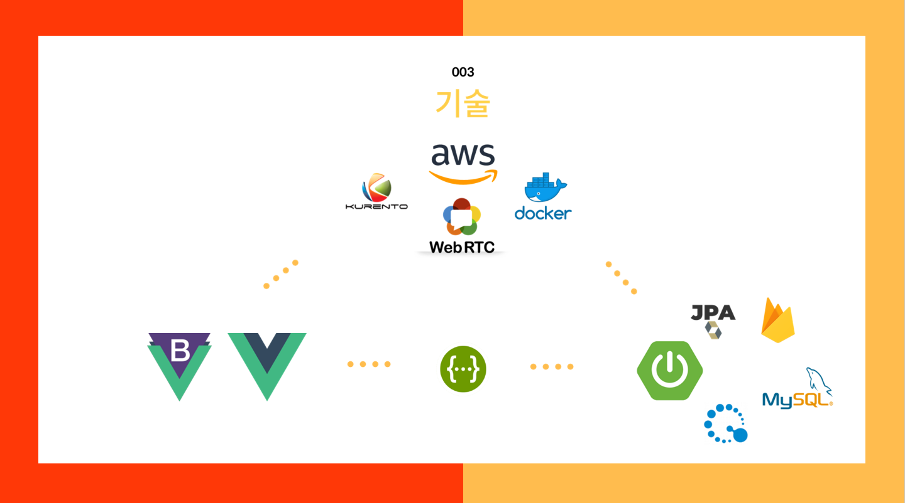
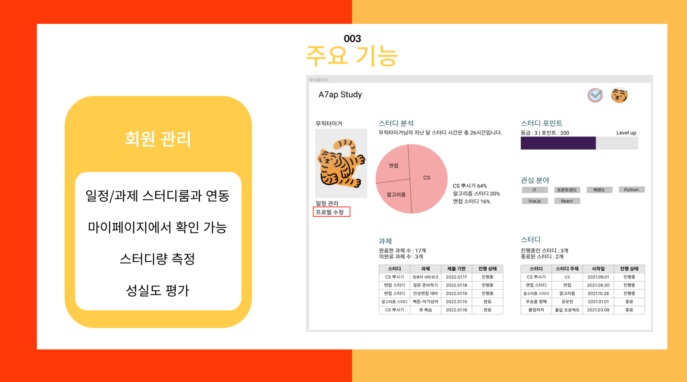

# ASAP

#### 프로젝트 소개

​	ASAP은 'As Study as possible'을 줄여서 만든 네이밍입니다.

​	ASAP은 하나의 웹사이트에서 화상희의를 통한 스터디 진행, 과제 파일 업로드, 스터디 일정 체크 및 스터디 진행량의 분석까지 할 수 있	는 웹 서비스입니다.

- **기획배경**

  > ASAP을 기획하게 된 이유는 크게 세가지입니다.
  >
  > 첫째, 스터디를 구하고는 싶지만 어디서 구할지 잘 모르겠다는 점, 스터디원을 모집하기도 힘들다는 점입니다. 
  >
  > 둘째, 각 스터디마다 일정이나 과제를 관리하기 번거롭다는 점입니다. 
  >
  > 마지막으로, 스터디를 진행할 때마다 너무나 많은 플랫폼을 사용하게 됩니다. 스터디원 모집에는 카카오톡, 실제 스터디 진행은 줌, 웹엑스, 구글 밋같은 플랫폼, 과제는 노션이나 깃으로 제출하는 식으로 하나의 스터디에 수많은 플랫폼이 사용됩니다. 이러한 불편한 점들을 개선하기 위해 ASAP에서는 하나의 웹사이트에서 다양한 기능을 모두 사용할 수 있도록 만들었습니다.

  

- **진행기간**

  2022.01.04 - 2022.02.18 (총 7주)

- **팀 소개**

  Front : 우윤석, 한슬기

  Back : 김민준, 김우찬

  RTC : 고주희, 이호진

- **기술스택**

  `Backend` : WebRTC (KURENTO), docker, aws, spring boot, JPA, querydsl

  `Frontend` : Vue.js, Js, HTML, CSS

  `DB` : MySQL, firebase

  

#### 주요기능

