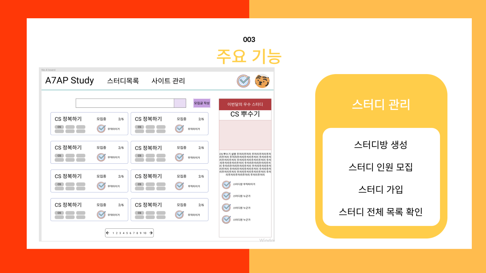

# ASAP

#### 프로젝트 소개

ASAP은 'As Study as possible'을 줄여서 만든 네이밍입니다.

​	ASAP은 하나의 웹사이트에서 화상희의를 통한 스터디 진행, 과제 파일 업로드, 스터디 일정 체크 및 스터디 진행량의 분석까지 할 수 있	는 웹 서비스입니다.

- **진행기간**

  2022.01.04 - 2022.02.18 (총 7주)

- **팀 소개**

  Front : 우윤석, 한슬기

  Back : 김민준, 김우찬

  RTC : 고주희, 이호진

- **기술스택**

  `Backend` : WebRTC (KURENTO), docker, aws, spring boot, JPA, querydsl

  `Frontend` : Vue.js, Js, HTML, CSS

  `DB` : MySQL, firebase

#### 주요기능

#### 프로젝트 실행 방법

